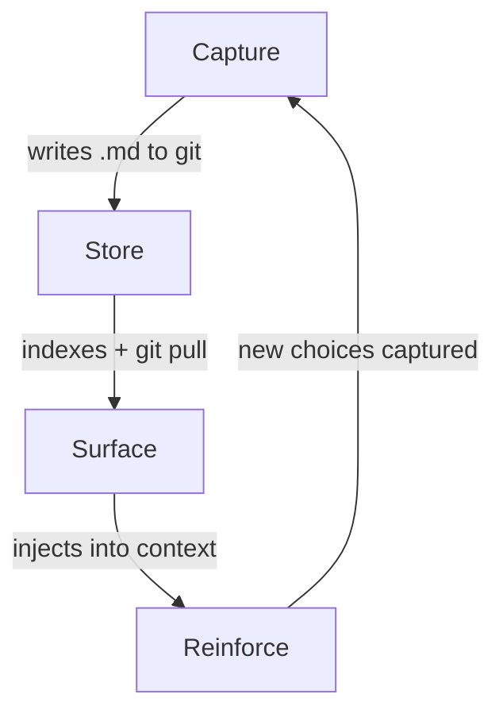

# code-decisions

[](https://github.com/zimalabs/code-decisions/actions/workflows/ci.yml)
[](https://www.python.org/downloads/)
[](LICENSE)

Decision memory for human + agent teams. Captures *why* choices were made so every Claude session — yours or a teammate's — inherits context instead of repeating debates.


**What you just saw:** Claude starts with 15 team decisions already loaded. A developer asks to use the ORM for dashboard queries — Claude flags an existing decision that prohibits it, explains why, and shows related dashboard decisions. When the developer moves on to refactoring with error handling, Claude implements it while respecting every constraint. Notice the message that appears as Claude edits `dashboard.py`: *"1 decision for dashboard.py: Use raw SQL for admin dashboard queries"* — decisions surface automatically as files are touched. No one searched for anything.

### The problem with agent teams

When one developer tells Claude "use raw SQL for dashboard queries," that context dies with the session. Tomorrow, another developer — or the same one in a new session — asks Claude to build a report page. Claude reaches for the ORM. The debate happens again.

Scale this to a team of developers each running Claude sessions in parallel. Every session starts from zero. Tribal knowledge doesn't transfer. The same mistakes get made, the same debates get repeated, the same constraints get violated.

**Code Decisions fixes this.** Decisions commit to git and surface automatically in every teammate's Claude session. One capture, many enforcements. The team's judgment compounds instead of resetting.

## How it works

The plugin runs a learning loop that gets smarter the more your team uses it:



**Capture** — You or Claude explain a choice ("use raw SQL, ORM is too slow"). The plugin detects decision language and writes a markdown file. No forms, no commands.

**Store** — The decision commits to git with `affects` paths pointing to the files it governs. Teammates inherit on `git pull`. Shows up in PRs, reviewable like any code change. Full-text search indexes it automatically.

**Surface** — Decisions load as project rules at session start. When anyone edits an affected file, relevant decisions inject into Claude's context *before it writes code*. No one searches. It's just there.

**Reinforce** — Claude respects the constraint instead of re-debating it. New choices made in that context get captured too — and the loop tightens. Never blocks — always advisory. `/decision undo` if it captures something wrong.

Decisions are captured once and surfaced many times. Each capture makes future sessions smarter. Each surface prevents a repeated debate.

## How is this different?

- **ADRs** — Same information, but ADRs are write-once documents in a `docs/` folder. Nobody searches them mid-coding. This plugin captures decisions the same way but **surfaces them at the moment of editing** — before code is written, not after someone remembers to look.
- **Inline comments** — Comments explain *what*. Decisions explain *why* — and travel across files via `affects` paths, so one decision can govern many files.
- **Claude memory** — Memories are personal notes that Claude may or may not recall. Decisions are team knowledge that **actively enforces itself** — they commit to git, surface for every teammate's Claude at the right moment, and show up in PRs.

## Getting started

Install in Claude Code:

```
/plugin marketplace add zimalabs/code-decisions
```
```
/plugin install decisions@zimalabs
```

Zero config. Works immediately after restart.

### Quick start

> **You:** "Use Redis for the job queue — Sidekiq is too heavy for 50 tenants"
>
> **Plugin:** *Captures `.claude/decisions/redis-job-queue.md` automatically*
>
> *...next week, you (or a teammate) edit `src/jobs/worker.py`...*
>
> **Plugin:** *◆ 1 decision for src/jobs/: Use Redis for the job queue*
>
> Claude respects the constraint without anyone searching for it.

### Everything is automatic

Just code normally. The plugin runs in the background:

- **Auto-capture** — When you or Claude explain a choice ("use raw SQL, ORM is too slow"), the plugin detects decision language and writes a markdown file. No commands needed.
- **Auto-surface** — When anyone edits an affected file, relevant decisions inject into Claude's context before it writes code. No one searches. It's just there.
- **Auto-index** — Full-text search indexes decisions on the fly. Teammates inherit on `git pull`.

### Skill and CLI also available

`/decision` handles search, capture, and management when you want explicit control:

| You type | What happens |
|----------|-------------|
| `/decision auth` | Searches past decisions about auth |
| `/decision we chose JWT because stateless` | Captures a new decision |
| `/decision show jwt-auth` | Displays a decision with body, tags, and affects |
| `/decision list` | Browse all decisions (filter with `--tag api`) |
| `/decision --tags` | Lists all tags with counts |
| `/decision --stats` | Shows decision health (`--health` for deep analysis) |
| `/decision tree` | Groups decisions by codebase area |
| `/decision coverage` | Shows what % of source files have decisions |
| `/decision enrich jwt-auth` | Audits a decision for quality (see below) |
| `/decision validate` | Checks all decision files for structural errors |
| `/decision undo` | Reverts the last capture (or specify a slug) |
| `/decision dismiss` | Suppresses nudges for the rest of this session |
| `/decision help` | Lists all commands and CLI usage |

### Decision quality audit

`/decision enrich <slug>` runs a quality analysis on any decision:

- **Conflicts** — finds decisions with overlapping scope and opposing guidance
- **Reasoning gaps** — checks for rationale, alternatives considered, trade-offs
- **Stale affects** — flags paths that no longer exist in the codebase
- **Suggestions** — actionable next steps to strengthen the decision

Use it after a quick capture to fill in gaps, or periodically with `/decision validate` to keep the whole set healthy.

## How `affects` matching works

Each decision declares an `affects` list — file paths that it governs. When anyone edits a file, the plugin checks whether it matches any decision's `affects` entries. Three matching modes are checked in order:

**Directory prefix** — entries ending with `/` match all files under that directory:

```yaml
affects: [src/auth/]
# matches: src/auth/oauth.py, src/auth/middleware.py, src/auth/tests/test_login.py
```

**Glob pattern** — entries with `*` or `?` use fnmatch-style matching:

```yaml
affects: [src/jobs/*.py]
# matches: src/jobs/worker.py, src/jobs/scheduler.py
# doesn't match: src/jobs/README.md
```

**Segment matching** — exact path-segment suffix comparison (no false substring matches):

```yaml
affects: [policy/engine.py]
# matches: src/decision/policy/engine.py (suffix match)
# doesn't match: src/policy_engine.py (not a segment boundary)
```

Segment matching also supports stem matching (`affects: [core]` matches `core.py`) and stem-prefix matching (`affects: [src/auth]` matches `src/auth_helpers.py` — but `affects: [log]` does *not* match `login.py`).

You never need to specify exact paths from root. The plugin finds the right files wherever they live.

## Getting your team started

**Week 1 — Seed a few decisions.** One person installs the plugin and captures 3-5 decisions from recent debates: "why Redis over Sidekiq," "why raw SQL for dashboards." Commit them to `.claude/decisions/` and push. These become the seed set.

**Week 2 — Install across the team.** Each teammate runs `/plugin install decisions@zimalabs`. On their next `git pull`, existing decisions auto-load. Auto-capture starts producing new ones from natural conversation.

**Week 3 — Prune and enrich.** Run `/decision validate` to fix structural issues and `/decision enrich <slug>` on thin decisions. Use `/decision coverage` to see which parts of the codebase lack decisions.

**Tips:**
- Decisions commit to git — they show up in PRs and are reviewable like code
- Start with high-debate areas (auth, data model, infrastructure) rather than trying to cover everything
- `/decision undo` if the auto-capture grabs something wrong — it's cheap to fix
- The plugin is always advisory and never blocks — safe to adopt incrementally

## Uninstalling

```
/plugin uninstall decisions@zimalabs
```

Your decisions stay exactly where they are — markdown files in `.claude/decisions/`, committed to git. They're yours. The plugin only writes and reads them; removing it just stops the automatic capture and surfacing.

To also remove the search index (rebuilds automatically if you reinstall):

```sh
rm -rf ~/.claude/projects/*/decision/
```

## Development

```sh
git clone https://github.com/zimalabs/code-decisions && cd code-decisions
uv sync            # install dev deps
make dev           # symlink plugin into Claude Code — use it while you hack on it
make check         # ruff + mypy + shellcheck + pytest
```
