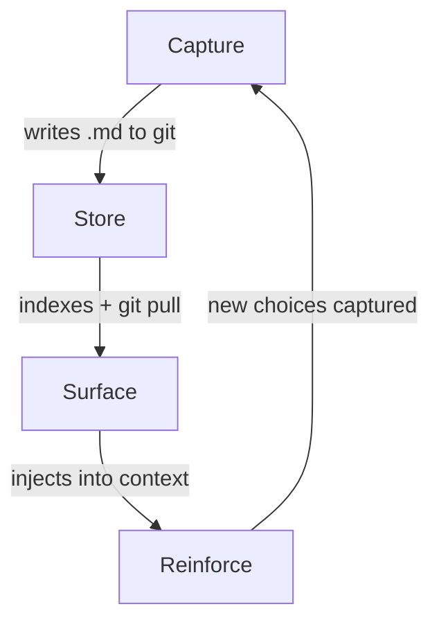

# code-decisions

[](https://github.com/zimalabs/code-decisions/actions/workflows/ci.yml)
[](https://www.python.org/downloads/)
[](LICENSE)

Claude Code plugin that captures *decisions* — automatically, during normal development, with zero workflow change. Every decision becomes searchable context for your team.


**What you just saw:** Claude starts with 15 team decisions already loaded. A developer asks to use the ORM for dashboard queries — Claude flags an existing decision that prohibits it, explains why, and shows related dashboard decisions. When the developer moves on to refactoring with error handling, Claude implements it while respecting every constraint. Notice the message that appears as Claude edits `dashboard.py`: *"1 decision for dashboard.py: Use raw SQL for admin dashboard queries"* — decisions surface automatically as files are touched. No one searched for anything.

## How it works

The plugin runs a learning loop that gets smarter the more your team uses it:



**Capture** — You or Claude explain a choice ("use raw SQL, ORM is too slow"). The plugin detects decision language and writes a markdown file. No forms, no commands.

**Store** — The decision commits to git with `affects` paths pointing to the files it governs. Teammates inherit on `git pull`. Shows up in PRs, reviewable like any code change. Full-text search indexes it automatically.

**Surface** — Decisions load as project rules at session start. When anyone edits an affected file, relevant decisions inject into Claude's context *before it writes code*. No one searches. It's just there.

**Reinforce** — Claude respects the constraint instead of re-debating it. New choices made in that context get captured too — and the loop tightens. Never blocks — always advisory. `/decision undo` if it captures something wrong.

Decisions are captured once and surfaced many times. Each capture makes future sessions smarter. Each surface prevents a repeated debate.

## Getting started

Install in Claude Code:

```
/plugin marketplace add zimalabs/code-decisions
```
```
/plugin install decisions@zimalabs
```

Zero config. Works immediately after restart.

### Everything is automatic

Just code normally. The plugin runs in the background:

- **Auto-capture** — When you or Claude explain a choice ("use raw SQL, ORM is too slow"), the plugin detects decision language and writes a markdown file. No commands needed.
- **Auto-surface** — When anyone edits an affected file, relevant decisions inject into Claude's context before it writes code. No one searches. It's just there.
- **Auto-index** — Full-text search indexes decisions on the fly. Teammates inherit on `git pull`.

### Skill and CLI also available

`/decision` handles search, capture, and management when you want explicit control:

| You type | What happens |
|----------|-------------|
| `/decision auth` | Searches past decisions about auth |
| `/decision we chose JWT because stateless` | Captures a new decision |
| `/decision --tags` | Browses decisions by topic |
| `/decision --stats` | Shows decision coverage health |
| `/decision undo` | Reverts the last capture |

## Development

```sh
git clone https://github.com/zimalabs/code-decisions && cd code-decisions
uv sync            # install dev deps
make dev           # symlink plugin into Claude Code — use it while you hack on it
make check         # ruff + mypy + shellcheck + pytest
```
